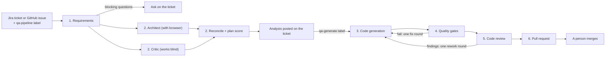

# Agentic QA pipeline with Playwright

A ticket goes in, from Jira or GitHub. Within minutes the ticket gets a QA analysis back: user story, acceptance criteria, risk, open questions and a scored test plan. One more label and a pull request with reviewed Playwright tests comes out. In between, AI agents do the legwork a QA engineer normally does by hand: clarify the requirement, design the tests, write them, review them. Plain scripts check everything that can be checked without an opinion, and a person decides whether the result is merged.

I built this to show what I think QA looks like when agents take the repetitive work and people keep the judgement. It is a portfolio project, and it is also a working shell: everything specific to the app under test lives in a config file, two documents and the tests themselves. The agents and workflows do not know which app they are testing, or which tracker the requirement came from.

The demo target is [Swag Labs](https://www.saucedemo.com), a public practice shop. The baseline suite has 19 tests over login, cart and checkout.

To see it without running anything, follow the [demo guide](docs/DEMO.md): ten minutes through real tickets, pull requests and runs in this repository.

## How it works



There are two halves, run by two workflows, so the cheap, fast part is not held hostage by the slow one.

**QA analysis** (`qa-analysis.yml`) starts when a ticket gets the `qa-pipeline` label. No test code is written. What comes back on the ticket is everything a QA lead would want to say about a story before anyone builds or tests it.

1. **Requirements.** An analyst agent turns the ticket into a user story and Given/When/Then acceptance criteria, each marked happy, negative or edge. It also lists assumptions, what is out of scope, a risk rating and open questions. If any question is blocking, the ticket gets the questions and the `qa-needs-info` label, and the run stops there.
2. **Strategy.** A test architect opens the app in a real browser (through the Playwright MCP server), checks what the suite already covers, and designs test cases. Each case has a design technique, a level (e2e, lower-layer or manual), a priority and a persona. The architect also lists the existing behaviour the feature could break and names the test that guards each one, or says that nothing does, so the team can see where the suite is thin around the change. At the same time a critic, who never sees the plan, writes the checklist a good plan must satisfy. A reconciler merges the two and adds cases where the checklist found a gap. Then a plan health score is computed in code (see below).
3. **Report.** The analysis is posted on the ticket, as markdown on GitHub and as a formatted comment on Jira. If the plan scores at least `minPlanScore` the ticket gets `qa-analyzed` and the comment says how to go on.

**QA tests** (`qa-tests.yml`) starts when the ticket gets the `qa-generate` label. It picks up the latest analysis of that ticket and reads the ticket again, in case the feature has been built since.

4. **Code generation.** An automation engineer agent writes the Playwright tests and page objects for the e2e cases, following `docs/test-conventions.md`, and runs them. Tests are tagged with the ticket key (`@SHOP-123`, or `@REQ-12` for GitHub issue 12) and `@AC-n`, so each one traces back to the ticket and the criterion it proves.
5. **Quality gates.** No AI here, only checks with a pass or fail answer. If any blocking gate fails, the report goes back to the engineer once.
6. **Code review.** A reviewer agent with fresh context and read-only access reads the diff and the gate report. Its main question for each criterion: would this test fail if the behaviour broke? Blocker or major findings, or any automated criterion it cannot verify, send the change back for one round of rework, through the gates again, and a second review.
7. **Pull request.** A plain workflow step opens it, not an agent. The description has the traceability table (criterion, tests, whether the reviewer verified it), the strategy, the review, and what each agent run took. If the review still has findings after rework, the pull request is a draft. The ticket gets a comment with the link. Either way a person reads it and merges it.

### Built or not built yet

The same ticket can be tested two ways, and the ticket says which: the `qa-test-first` label, or "No, write the tests first" in the GitHub issue form.

- **Built** (the default). Tests are written against the running feature and must pass. If the app disagrees with a criterion, the engineer keeps the correct assertion, marks the test `test.fail(true, 'bug: AC-n ...')` and reports a suspected bug.
- **Test-first.** The feature does not exist yet, so the architect cannot see it. It walks the parts that do exist and writes a **contract**: every element the tests will need and the locator they will use. That table is in the analysis on the ticket, so the developers build to it. The engineer writes the tests against the contract and marks each one `test.fail(true, 'not built yet: SHOP-123')`. They pass today because they fail, and a gate checks that each one fails because the feature is missing, not because of a mistake in the test. On the day the feature lands, Playwright reports them as "expected to fail, but passed", the regression run lists them as landed, and the markers come off. That is acceptance-test-driven development, with the acceptance tests written by the pipeline.

### The quality gates

| Gate | Passes when |
|---|---|
| Scope | Only `tests/`, `pages/` and `fixtures/` changed, nothing was deleted or moved, at least one spec file changed, and existing spec files only gained lines |
| Types | `npx tsc --noEmit` |
| Lint | `npx eslint` on the three folders, with the Playwright rules set to error |
| Expected failures | Every `test.fail()` the change adds has one of the two reasons. Bug markers name a criterion and there are no more of them than reported bugs. "Not built yet" markers only appear in test-first mode, and name the ticket |
| Traceability | Every criterion the plan assigns to an e2e case has a test tagged with it and with the ticket key |
| Full suite | Every test in the repository passes with no retries |
| Stability | The new tests give the same result `stabilityRuns` times in a row (3 in the demo config) |
| Fails for the right reason | Every expected failure failed on an assertion or a missing element, not on a `TypeError` or a network error. A crashing test also "fails as expected", and would otherwise sail through |
| Sensitivity | The new tests are run against versions of the app known to be broken (`sensitivity.targets`); see below |
| Accessibility | An axe scan of every page the new tests end on. Reported on the pull request; it stops a run only if `accessibility.required` is set |

The last six only run if the first four pass.

**Sensitivity** is the gate I would most want to be asked about. The reviewer's main question, would this test fail if the behaviour broke, is otherwise answered by a model reading code. Here it is answered by running it. Swag Labs ships accounts that break the shop on purpose, so the new tests run once as each of them, and the gate reports which tests each one caught, and which tests never failed against any of them. In your own app a target is any set of environment variables that points the suite at something known to be wrong: an old build, a feature flag, a stubbed backend. It is advisory by default, because a breakage elsewhere in the app proves nothing about your feature; set `sensitivity.required` to make it block.

### The plan health score

The score is arithmetic over facts, so a plan cannot talk its way to a pass.

| Measure | Weight |
|---|---|
| Acceptance criteria that have a test case | 40 |
| Critic's checklist items covered (`must` items count double) | 30 |
| Negative and edge criteria that have a test case (none in the requirement scores 0) | 20 |
| Cases that are automated rather than manual | 10 |

### Regression and failure triage

A second workflow, **Regression**, runs the unit tests and the suite on push, on pull requests, nightly and on demand. When the suite fails, a triage agent reads the error context and screenshots Playwright saved, and gives each failure one verdict: product bug, test defect, flaky or environment, with its confidence, the evidence and a next step. Product bugs are grouped by root cause and filed as issues. Each bug carries a fingerprint per test it breaks, and matches an open issue that shares any of them, so the same bug is not filed twice even when it starts breaking one more test. The fingerprints are taken from the failures as Playwright reported them, not from the agent's wording, so they hold from run to run.

Every run also puts a **traceability map** on its summary page, built from the tags with no model involved: each requirement the suite has tests for, the criteria those tests claim, and how many pass, fail, flake or are expected failures. It is the standing answer to "why does this test exist, and is the thing it guards working?". `npm run coverage` prints the same locally.

Tests marked `test.fail()` that suddenly pass are not sent to the agent. They are listed on their own: the bug was fixed or the feature has landed, and the marker should come off.

The quick way to see triage work: run Regression by hand with the persona `problem_user`. That is an account the demo shop breaks on purpose.

### Self-healing

When triage says a failure is the test's fault, a locator that no longer matches or an expected value that is out of date, a healer agent repairs the test and the repair is opened as a pull request against the branch that failed. It looks at the page as it is now, makes the smallest change, and says in one sentence what had changed in the app and what it changed in the test.

New tests have to leave existing lines alone. A repair cannot, so its gates swap that rule for another: **nothing weakened**. No skips, no expected-failure markers, and no file left with fewer assertions than it had. Then the repaired files have to pass several times in a row, and so does the whole suite. A product bug is never healed: the test keeps failing and the bug is filed.

To see it: the branch `demo/locator-drift` has one stale locator on the checkout page. Run Regression on that branch.

### Accessibility

The accessibility gate does not scan a list of URLs. With `QA_A11Y` set, the shared fixture attaches an axe scan to every passing test, taken on the page the test ended on. So the pages are scanned in the states the tests reach: signed in, cart filled, half way through checkout. The gate merges the findings by rule and puts them in the pull request, worst first, with the ones axe could not decide listed as needing a person.

It never says a page passed. Automated checks find only part of what WCAG asks for, so a clean scan is reported as "no violations detected by axe", not as accessible. That rule comes from a separate compliance scanner of mine, which reports violations, items for human review and things not assessed, and has no pass state at all.

### Run history

After every QA analysis and QA tests run, a third workflow records what happened on the `qa-history` branch: the plan score, each gate's result, the review verdict, how many rounds it took, and the time and estimated cost of every agent. `README.md` on that branch is a table of all runs with totals: gate pass rate, how often the review approved first time, which gate fails most, average cost per run. `index.html` is the same as a dashboard, in one file with no external scripts, ready to be served by GitHub Pages once the repository is public.

## Guardrails

The agents are useful only as long as the things around them are strict.

- **Least access per role.** The analyst, architect, critic, reconciler, reviewer and triager can read the repository and nothing else. The engineer can also write, but only in the three folders listed in `qa.config.json`, and can run only `npx playwright test`, `npx tsc` and `npx eslint`. Agents run in `dontAsk` permission mode, so anything not on the allowlist is refused outright. The settings, hooks and MCP servers of whoever runs the pipeline are not loaded.
- **A limited browser.** The two agents that get a browser can navigate, click, type and read page snapshots. Script evaluation and file upload are not on the list. An agent whose every browser call failed is stopped instead of trusted.
- **Credentials are kept apart.** The Claude token lives on the `POC` environment and is given only to the steps that run an agent. The tracker credentials (the Jira token, and the GitHub token for issues) live on the `TRACKER` environment and are given only to the jobs that read or write the ticket, where no agent runs. The job that pushes the branch and opens the pull request has neither.
- **Structured answers.** Every agent has to answer in a schema (`agents/lib/schemas.ts`), validated with zod before the next stage reads it. A malformed answer fails the job.
- **Input is data.** The ticket text, diffs and anything read from the app under test are wrapped in tags and the agents are told to treat them as material to analyse, never as instructions. Ticket references are checked against a strict pattern before they reach a shell, an API path or a branch name.
- **The analysis has a known origin.** The test workflow only picks up an analysis made by `qa-analysis.yml` in this repository, on the default branch, so a pull request from a fork cannot plant one. The plan and the request are read once, before any generated test runs, and the gates work from that copy; the files are also written back afterwards for the jobs that follow. The publish job refuses a patch that touches anything outside the writable folders before it applies it.
- **Only trusted people can start a run.** On GitHub only people with triage rights can add a label. From Jira, only the holder of a token with write access to the repository can send the event.
- **Verdicts are recomputed.** The plan score is calculated in code. References to test cases or criteria that do not exist are dropped before scoring. An "approve" that lists a blocker or major finding, or leaves an automated criterion unverified, is turned into "request changes". The scope gate checks what was written, whatever the engineer says it wrote, and the expected-failure gate checks every `test.fail()` against what the engineer reported.
- **A person merges.** The pipeline can open a pull request. It cannot approve or merge one.

## Limits

- The reviewer is the same model family as the engineer. Fresh context and read-only access help, but it is not independent the way a second person is. This is why the human review at the end is not optional. The sensitivity gate narrows the gap by running code instead of reading it, but only for breakages your targets cover.
- The agent stages are not deterministic. The same ticket can produce a different plan and different tests on two runs. The gates are deterministic, the agents are not.
- "Treat it as data" is an instruction to a model, not a hard barrier. The hard barriers are the tool allowlist, the scope gate and the credential separation.
- The engineer runs the tests it writes, and test code runs with the job's environment. In principle it could write a test that reads that environment. Treat the Claude token as exposed to generated code, and scope it accordingly.
- In test-first mode the tests are only as good as the contract. If the developers build something the contract did not say, the tests fail for the wrong reason on the day the feature lands, and need a person to adjust them.
- Jira comments are converted from markdown to Atlassian's document format. Headings, tables, lists, bold, code and links survive; if Jira refuses a document, the report is posted as plain text instead.
- A run takes time and costs money, and both vary with the requirement. I am not quoting numbers here: the pull request description records turns, time and estimated cost for every agent run.
- Swag Labs has no API and no source code I can reach, so every automated test against it is a browser test. The plan can still name lower-layer cases, so the gap is visible, but this repository cannot write them.
- The accessibility gate scans the page a test ends on, not every page it passes through.
- The healer trusts triage's verdict. If triage calls a product bug a test defect, the healer is told to stop when it sees the app is wrong, and the gates stop a weakened test, but a person reading the pull request is the real check.

## Setup

Requirements: Node 22.18 or newer (it runs the TypeScript unit tests directly).

```bash
npm ci
npx playwright install chromium
npm run test:unit
npm run doctor
```

`doctor` checks a checkout before any agent is started: the config and the documents it points to, the writable folders, the browser, that the app answers, and which credentials it can see. It is the first thing to run after pointing the shell at a new app.

**Claude.** Pick one, and save it as a secret on an environment named `POC` (Settings > Environments):

- (a) A Claude Pro or Max subscription. Run `claude setup-token` and save the result as `CLAUDE_CODE_OAUTH_TOKEN`. This is what the demo uses. It is meant for personal use, so a team should use option (b).
- (b) An API key, saved as `ANTHROPIC_API_KEY`.

The optional repository variable `QA_AGENT_MODEL` picks the model for every role; `models` in `qa.config.json` picks one per role (for example `{ "plan-critic": "haiku" }`). The default is `sonnet`.

**Repository settings.**

- Settings > Actions > General > Workflow permissions: allow GitHub Actions to create pull requests.
- Create an environment named `TRACKER`. For GitHub issues alone it needs nothing in it.
- Create the labels `qa-pipeline`, `qa-generate` and `qa-test-first`. The pipeline creates `qa-analyzed` and `qa-needs-info` itself the first time it needs them.

### Jira

1. **Credentials.** On the `TRACKER` environment, add the variable `JIRA_BASE_URL` (`https://your-site.atlassian.net`) and the secrets `JIRA_EMAIL` and `JIRA_API_TOKEN` (an API token from id.atlassian.com, for an account that can read the project's tickets and comment on them).
2. **A token for Jira to call GitHub.** Create a fine-grained personal access token for this repository only, with **Contents: read and write** (that is what `repository_dispatch` needs). It goes in the Jira rules below and nowhere else.
3. **Two Automation rules** (Project settings > Automation), one per label:
   - Trigger: **Field value changed**, field *Labels*. Condition: **Labels contains** `qa-pipeline`.
   - Action: **Send web request**
     - URL: `https://api.github.com/repos/<owner>/<repo>/dispatches`, method POST
     - Headers: `Accept: application/vnd.github+json` and `Authorization: Bearer <the token>` (mark it hidden)
     - Body (custom data): `{"event_type": "qa-analyze", "client_payload": {"source": "jira", "ref": "{{issue.key}}"}}`

   The second rule is the same for the label `qa-generate`, with `"event_type": "qa-generate"`.
4. **Acceptance criteria in a custom field?** Name it in `qa.config.json` under `jira.fields`, for example `{ "Acceptance criteria": "customfield_10035" }`. It is read along with the description.

To run the test-first way, add the `qa-test-first` label to the ticket as well.

## Running it

**From a ticket.** Add `qa-pipeline` to a GitHub issue (the "QA requirement" template helps) or a Jira ticket. Read the analysis that comes back. If you agree with it, add `qa-generate`. Each job also writes its result to the run's summary page.

**By hand.** Actions > QA analysis (or QA tests) > Run workflow, with the source and the issue number or ticket key.

**Locally.** With the Claude Code CLI signed in (`claude` then `/login`), or one of the two tokens in your environment:

```bash
# The analysis only: requirements, plan, score. Prints the report; posts it too when the source is a tracker.
npm run pipeline -- analyze --source jira --ref SHOP-12
npm run pipeline -- analyze --title "Sort products" --text "As a shopper I want to ..."

# Both halves, start to finish. Start from a clean working tree: the scope gate reads git status.
npm run pipeline -- all --title "Sort products" --text "As a shopper I want to ..."
npm run pipeline -- all --test-first --file requirement.md

# The baseline suite, and the pipeline's own unit tests
npm test
npm run test:unit

# After a failed run: classify the failures in test-results/results.json
npm run triage

# Which requirement each test exists for, and how it did in the last run
npm run coverage
```

A local run leaves its documents in `qa-run/` (request, requirements, strategy, analysis, gate report, reviews, `pull-request.md`) and the generated tests in your working tree. Each new requirement starts from an empty `qa-run/`. A requirement given with `--text` or `--file` uses the key `REQ-0`. A local run posts its analysis to the ticket when the source is a tracker, but never an outcome for the tests: there is no pull request to point at.

To run the suite as another persona, set `SAUCE_USER`, for example `SAUCE_USER=problem_user npm test`. `BASE_URL` overrides the address in `qa.config.json`.

## Try the demo

Sorting the product list is deliberately not covered by the baseline suite, which makes it a good first requirement:

> **Sort products.** As a shopper I want to sort the product list by name or price so I can find what I want faster.

Open that as an issue, add `qa-pipeline`, and read the analysis that comes back: the assumptions the analyst made, which cases the critic's checklist added, and the plan score. Then add `qa-generate` and read the pull request: the gate report, the sensitivity table (Swag Labs' broken accounts break sorting, so the new tests should catch them), and the reviewer's answer per criterion.

For test-first, try something the shop does not have:

> **Search products.** As a shopper I want to search the product list by name so I can find an item without scrolling.

Choose "No, write the tests first". The analysis comes back with a contract for a search box that does not exist, and the pull request with tests that fail, for the right reason, until someone builds it.

## Repository layout

| Path | What it holds |
|---|---|
| `qa.config.json` | The app's name and URL, where its brief and conventions are, the writable folders, `minPlanScore`, `stabilityRuns`, the sensitivity targets, models per role, Jira fields |
| `docs/product-brief.md` | What the app does, its accounts and its quirks. The agents' only product knowledge besides the browser |
| `docs/test-conventions.md` | The rules the suite follows, including the two kinds of expected failure. The engineer writes to them and the reviewer checks against them |
| `docs/test-design.md` | Short notes on choosing a design technique and a test level, used by the strategy agents |
| `agents/cli.ts` | Runs one stage, a half (`analyze`, `tests`) or everything (`all`) |
| `agents/stages.ts` | The pipeline, one function per stage, the verdict rules and the reports to the ticket |
| `agents/gates.ts` | The quality gates |
| `agents/triage.ts` | Failure triage for a regression run |
| `agents/coverage.ts` | The traceability map (`npm run coverage`) |
| `agents/doctor.ts` | The preflight check (`npm run doctor`) |
| `agents/heal.ts` | Self-healing: repairs test defects found by triage (`npm run heal`) |
| `agents/history.ts` | Records a run and renders the run history (`npm run history`) |
| `agents/sources/` | One adapter per tracker (GitHub, Jira) and the markdown/ADF conversion for Jira |
| `agents/prompts/` | One instruction file per role |
| `agents/lib/` | The agent runner and its permissions, the schemas, the plan score, keys and labels, markdown rendering, the run folder |
| `agents/test/` | Unit tests for the pipeline itself (`npm run test:unit`) |
| `tests/`, `pages/`, `fixtures/` | The Playwright suite: specs, page objects, the shared `test` fixture and personas |
| `.github/workflows/qa-analysis.yml` | The analysis half: ticket in, analysis posted back |
| `.github/workflows/qa-tests.yml` | The test half: analysis in, pull request out |
| `.github/workflows/regression.yml` | Unit tests, the suite, the traceability map, and on failure: triage, bug filing and self-healing |
| `.github/workflows/qa-history.yml` | Records every pipeline run on the `qa-history` branch |
| `.github/actions/setup/` | Shared setup steps for the jobs |
| `.github/ISSUE_TEMPLATE/requirement.yml` | The "QA requirement" issue template |

## Use it on your own app

1. Edit `qa.config.json`: name, base URL, pass mark, stability runs, and sensitivity targets that point at known-broken versions of your app (or an empty list).
2. Rewrite `docs/product-brief.md` for your app, and `docs/test-conventions.md` for how your team writes tests.
3. Replace `pages/`, `fixtures/` and `tests/` with your own. Keep `fixtures/test.ts` as the place specs import `test` and `expect` from, or change the conventions to match.
4. Adjust the persona input in `regression.yml`. The persona is passed as the `SAUCE_USER` environment variable, which `fixtures/personas.ts` and `agents/triage.ts` read. Rename it if the name bothers you.
5. Connect your tracker: GitHub issues work as they are; for Jira, follow the Jira setup above.
6. Run `npm run doctor` and fix what it reports.

The prompts in `agents/prompts/` and the code in `agents/` should not need changes. Another tracker is one more file in `agents/sources/` with three functions: read a ticket, comment on it, change its labels.

## License

MIT. See [LICENSE](LICENSE).

Lawrence Moran, QA engineer.
