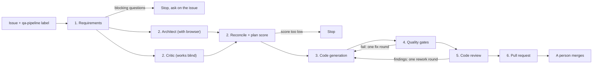

# Agentic QA pipeline with Playwright

A GitHub issue goes in. A pull request with reviewed Playwright tests comes out. In between, AI agents do the legwork a QA engineer normally does by hand: clarify the requirement, design the tests, write them, review them. Plain scripts check everything that can be checked without an opinion, and a person decides whether the result is merged.

I built this to show what I think QA looks like when agents take the repetitive work and people keep the judgement. It is a portfolio project, and it is also a working shell: everything specific to the app under test lives in a config file, two documents and the tests themselves. The agents and workflows do not know which app they are testing.

The demo target is [Swag Labs](https://www.saucedemo.com), a public practice shop. The baseline suite has 19 tests over login, cart and checkout.

## How it works



The requirement is a GitHub issue. Adding the `qa-pipeline` label starts the **QA pipeline** workflow. Each stage is its own job in the Actions graph, and each leaves its result in a run folder as JSON for the next stage and as markdown for people.

1. **Requirements.** An analyst agent turns the issue into a user story and Given/When/Then acceptance criteria, each marked happy, negative or edge. It also lists assumptions, what is out of scope, a risk rating and open questions. If any question is blocking, the run stops, the questions are posted on the issue and it gets the `qa:needs-info` label.
2. **Strategy.** A test architect opens the app in a real browser (through the Playwright MCP server), checks what the suite already covers, and designs test cases. Each case has a design technique, a level (e2e, lower-layer or manual), a priority and a persona. At the same time a critic, who never sees the plan, writes the checklist a good plan must satisfy. A reconciler merges the two and adds cases where the checklist found a gap. Then a plan health score is computed in code (see below). Below `minPlanScore` the run stops before any test code is written.
3. **Code generation.** An automation engineer agent writes the Playwright tests and page objects for the e2e cases, following `docs/test-conventions.md`, and runs them. Tests are tagged `@REQ-n` and `@AC-n` so each one traces back to the issue and the criterion it proves. If the app disagrees with a criterion, the engineer keeps the correct assertion, marks the test `test.fail()` and reports a suspected bug.
4. **Quality gates.** No AI here, only commands with a pass or fail answer:

   | Gate | Passes when |
   |---|---|
   | Scope | Only `tests/`, `pages/` and `fixtures/` changed, nothing was deleted, and at least one spec file changed |
   | Types | `npx tsc --noEmit` |
   | Lint | `npx eslint` on the three folders, with the Playwright rules set to error |
   | Traceability | Every criterion the plan assigns to an e2e case has a test tagged with it and with the requirement |
   | Full suite | Every test in the repository passes with no retries |
   | Stability | The new tests pass `stabilityRuns` times in a row (3 in the demo config) |

   The last three only run if the first three pass. If any gate fails, the report goes back to the engineer once.
5. **Code review.** A reviewer agent with fresh context and read-only access reads the diff. Its main question for each criterion: would this test fail if the behaviour broke? Blocker or major findings send the change back for one round of rework, through the gates again, and a second review.
6. **Pull request.** A plain workflow step opens it, not an agent. The description has the traceability table (criterion, tests, whether the reviewer verified it), the strategy, the review, and what each agent run took. If the review still has findings after rework, the pull request is a draft. Either way a person reads it and merges it.

### The plan health score

The score is arithmetic over facts, so a plan cannot talk its way to a pass.

| Measure | Weight |
|---|---|
| Acceptance criteria that have a test case | 40 |
| Critic's checklist items covered (`must` items count double) | 30 |
| Negative and edge criteria that have a test case | 20 |
| Cases that are automated rather than manual | 10 |

### Regression and failure triage

A second workflow, **Regression**, runs the suite on push, on pull requests, nightly and on demand. When it fails, a triage agent reads the error context and screenshots Playwright saved, and gives each failure one verdict: product bug, test defect, flaky or environment, with its confidence, the evidence and a next step. Product bugs are grouped by root cause and filed as issues. Each bug gets a fingerprint built from the tests it breaks, so the same bug is not filed twice.

The quick way to see triage work: run Regression by hand with the persona `problem_user`. That is an account the demo shop breaks on purpose.

## Guardrails

This is the part I would want to be asked about. The agents are useful only as long as the things around them are strict.

- **Least access per role.** The analyst, architect, critic, reconciler, reviewer and triager can read the repository and nothing else. The engineer can also write, but only in the three folders listed in `qa.config.json`, and can run only `npx playwright test`, `npx tsc` and `npx eslint`. Agents run in `dontAsk` permission mode, so anything not on the allowlist is refused outright. The settings, hooks and MCP servers of whoever runs the pipeline are not loaded.
- **A limited browser.** The two agents that get a browser can navigate, click, type and read page snapshots. Script evaluation and file upload are not on the list.
- **Tokens are kept apart.** Agent jobs never get a GitHub token. The jobs that push a branch, comment or open the pull request never get the Claude token.
- **Structured answers.** Every agent has to answer in a schema (`agents/lib/schemas.ts`), validated with zod before the next stage reads it. A malformed answer fails the job.
- **Input is data.** The issue text, diffs and anything read from the app under test are wrapped in tags and the agents are told to treat them as material to analyse, never as instructions.
- **Label-triggered.** Only people with triage rights on the repository can add a label, so only they can start a run.
- **Verdicts are recomputed.** The plan score is calculated in code. References to test cases or criteria that do not exist are dropped before scoring. An "approve" that lists a blocker or major finding is turned into "request changes". The scope gate checks what was written, whatever the engineer says it wrote.
- **A person merges.** The pipeline can open a pull request. It cannot approve or merge one.

## Limits

- The reviewer is the same model family as the engineer. Fresh context and read-only access help, but it is not independent the way a second person is. This is why the human review at the end is not optional.
- The agent stages are not deterministic. The same issue can produce a different plan and different tests on two runs. The gates are deterministic, the agents are not.
- "Treat it as data" is an instruction to a model, not a hard barrier. The hard barriers are the tool allowlist, the scope gate and the token separation.
- The engineer runs the tests it writes, and test code runs with the job's environment. In principle it could write a test that reads that environment. Treat the Claude token as exposed to generated code, and scope it accordingly.
- A run takes time and costs money, and both vary with the requirement. I am not quoting numbers here: the pull request description records turns, time and estimated cost for every agent run.
- Swag Labs has no API and no source code I can reach, so every automated test in the demo is a browser test. The plan can still name lower-layer cases, so the gap is visible, but this repository cannot write them.

## Setup

Requirements: Node 22 or newer.

```bash
npm ci
npx playwright install chromium
```

**Authentication.** Pick one:

- (a) A Claude Pro or Max subscription. Run `claude setup-token` and save the result as the repository secret `CLAUDE_CODE_OAUTH_TOKEN`. This is what the demo uses. It is meant for personal use, so a team should use option (b).
- (b) An API key, saved as the repository secret `ANTHROPIC_API_KEY`.

The optional repository variable `QA_AGENT_MODEL` picks the model. The default is `sonnet`.

**Repository settings.**

- Settings > Actions > General > Workflow permissions: allow GitHub Actions to create pull requests.
- Create the labels `qa-pipeline` and `qa:needs-info`.

## Running it

**On GitHub.** Open an issue with the "QA requirement" template, add the `qa-pipeline` label, and watch the Actions tab. Each job writes its result to the job summary.

**Locally.** With the Claude Code CLI signed in (`claude` then `/login`), or one of the two tokens in your environment:

```bash
# The whole pipeline, start to finish. Start from a clean working tree: the scope gate reads git status.
npm run pipeline -- all --title "Sort products" --text "As a shopper I want to ..."

# The baseline suite
npm test

# After a failed run: classify the failures in test-results/results.json
npm run triage
```

A local pipeline run leaves its documents in `qa-run/` (requirements, strategy, gate report, reviews, `pull-request.md`) and the generated tests in your working tree. It uses the key `REQ-0` because there is no issue number. `--file <path>` reads the requirement from a file instead of `--text`.

To run the suite as another persona, set `SAUCE_USER`, for example `SAUCE_USER=problem_user npm test`. `BASE_URL` overrides the address in `qa.config.json`.

## Try the demo

Sorting the product list is deliberately not covered by the baseline suite, which makes it a good first requirement:

> **Sort products.** As a shopper I want to sort the product list by name or price so I can find what I want faster.

Open that as an issue, add the label, and read the pull request that comes back. Things worth looking at: the assumptions the analyst made, which cases the critic's checklist added, the plan score, and the reviewer's answer per criterion.

## Repository layout

| Path | What it holds |
|---|---|
| `qa.config.json` | The app's name and URL, where its brief and conventions are, the writable folders, `minPlanScore`, `stabilityRuns` |
| `docs/product-brief.md` | What the app does, its accounts and its quirks. The agents' only product knowledge besides the browser |
| `docs/test-conventions.md` | The rules the suite follows. The engineer writes to them and the reviewer checks against them |
| `docs/test-design.md` | Short notes on choosing a design technique and a test level, used by the strategy agents |
| `agents/cli.ts` | Runs one stage, or all of them with `all` |
| `agents/stages.ts` | The pipeline, one function per stage, and the plan health score |
| `agents/gates.ts` | The quality gates |
| `agents/triage.ts` | Failure triage for a regression run |
| `agents/prompts/` | One instruction file per role |
| `agents/lib/` | The agent runner and its permissions, the schemas, markdown rendering, the run folder |
| `tests/`, `pages/`, `fixtures/` | The Playwright suite: specs, page objects, the shared `test` fixture and personas |
| `.github/workflows/qa-pipeline.yml` | The QA pipeline workflow |
| `.github/workflows/regression.yml` | The regression workflow with triage |
| `.github/actions/setup/` | Shared setup steps for the jobs |
| `.github/ISSUE_TEMPLATE/requirement.yml` | The "QA requirement" issue template |

## Use it on your own app

1. Edit `qa.config.json`: name, base URL, pass mark, stability runs.
2. Rewrite `docs/product-brief.md` for your app, and `docs/test-conventions.md` for how your team writes tests.
3. Replace `pages/`, `fixtures/` and `tests/` with your own. Keep `fixtures/test.ts` as the place specs import `test` and `expect` from, or change the conventions to match.
4. Adjust the persona input in `regression.yml`. The persona is passed as the `SAUCE_USER` environment variable, which `fixtures/personas.ts` and `agents/triage.ts` read. Rename it if the name bothers you.

The prompts in `agents/prompts/` and the code in `agents/` should not need changes.

## License

MIT. See [LICENSE](LICENSE).

Lawrence Moran, QA engineer.
