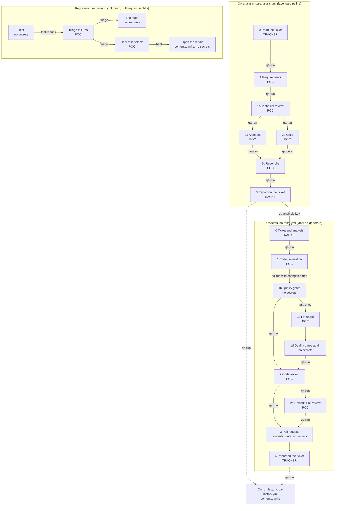

# Architecture

One page: the jobs and what passes between them, the agent roles, and the gates. The README says why it is built
this way; [OPERATIONS.md](OPERATIONS.md) says how to run it.

## Jobs, artifacts and credentials

Each box is a GitHub Actions job. Arrows carry an artifact: `qa-run/` is the run folder (JSON for the next stage,
markdown for people), passed from job to job. The second line of each box says which credential the job may hold.

| Credential | Lives in | Given to | Never given to |
|---|---|---|---|
| `CLAUDE_CODE_OAUTH_TOKEN` or `ANTHROPIC_API_KEY`, or `QA_PROVIDER_ENV` (Bedrock, Vertex) | `POC` environment | The one step in a POC job that runs an agent | Any job that holds a tracker token or can push, and the gates jobs |
| `JIRA_*`, `AZURE_DEVOPS_*`, `LINEAR_*` | `TRACKER` environment | The intake and report steps | Any job that runs an agent |
| GitHub token with `issues` | Workflow token | Intake, report and bug filing jobs, through `gh` | Agents |
| GitHub token with `contents: write` | Workflow token | The pull request jobs (no agent, no Claude token) and the history writer | Agents, and generated test code |
| Fine-grained token for `repository_dispatch` | Jira Automation rules | Jira, to start a workflow | The repository and its jobs |

Two things follow from the layout. Generated test code runs where the engineer runs it, in a POC job, so it can see
the Claude token and nothing else for that long; the gates, which run it far more (the whole suite, the stability
runs, the known-broken targets), hold no credentials at all; and the patch is checked again (`npx agentic-qa apply`
refuses any path outside the writable folders) in every job that applies it. And every file a later job reads from
`qa-run/` passed through a job where generated code ran, so the stages read the plan once, before that code runs,
and write it back afterwards.

A project that installs the engine runs these same workflows with `uses:` from callers `npx agentic-qa init`
writes, with its own environments and secrets. The engine finds the project as the nearest `qa.config.json` above
the working directory, and its own prompts and templates next to its code.

## Agent roles

Every agent runs with `permissionMode: dontAsk` and no user settings, hooks or MCP servers: whatever is not on its
list is refused. "Read" means Read, Glob and Grep inside the repository. "Browser" means the Playwright MCP server
with navigate, back, snapshot, click, type, fill form, select option, press key, wait and close; script evaluation
and file upload are not on the list.

| Role | Runs in | Access | Tools | Answers in |
|---|---|---|---|---|
| `suite-surveyor` | `npx agentic-qa survey` | read | Read | `Survey` |
| `ticket-writer` | `npx agentic-qa draft`, `qa_draft_ticket` | read | Read, browser | `TicketDraft` |
| `skeptic` | QA analysis, 1 | read | Read | `Skepticism` |
| `requirements-analyst` | QA analysis, 1 | read | Read | `Requirements` |
| `technical-reviewer` | QA analysis, 1b | read | Read, browser | `TechnicalReview` |
| `test-architect` | QA analysis, 2a | read | Read, browser | `Plan` |
| `plan-critic` | QA analysis, 2b | read | Read | `Checklist` |
| `plan-reconciler` | QA analysis, 2c | read | Read | `Reconciled` |
| `automation-engineer` | QA tests, 1, 1c and 2b | write | Read, browser, Write and Edit in the writable folders, Bash for the suite's test, typecheck and lint commands only | `Generation` |
| `code-reviewer` | QA tests, 2 and 2b | read | Read | `Review` |
| `failure-triager` | Regression, triage | read | Read | `Triage` |
| `test-healer` | Regression, heal | write | as the engineer | `Healing` |

The schemas are in `agents/lib/schemas.ts`. An answer that does not parse fails the job; nothing downstream reads an
unvalidated answer.

## Gates and checks

Nothing here asks a model. Blocking means the run stops (or, for the gates, goes back to the engineer once).

**Gates on new tests** (`agents/gates.ts`, `runGates`). The last six run only when the first four pass.

| Gate | Checks | Blocks |
|---|---|---|
| Scope | Only the writable folders changed; nothing deleted or moved; at least one spec; existing files only grew | yes |
| Types | `suite.commands.typecheck` | yes |
| Lint | `suite.commands.lint` on the writable folders | yes |
| Expected failures | Every added `test.fail()` has a valid reason; bug markers name a criterion and match the reported bugs; "not built yet" only in test-first mode | yes |
| Traceability | Every criterion the plan sends to e2e has a test tagged with it and the ticket key | yes |
| Full suite | New tests pass with no retries; an existing failing test gets one retry by itself and is reported as flaky if it passes | yes |
| Stability | The new tests give the same result `stabilityRuns` times in a row | yes |
| Fails for the right reason | Each expected failure failed on an assertion or a missing element, not a crash | yes, when there are expected failures |
| Sensitivity | The new tests are run against `sensitivity.targets` (broken accounts, old builds, or a fault injected into every page); at least one must catch something | only with `sensitivity.required` |
| Accessibility | axe scan of the pages the new tests end on | only with `accessibility.required` |

**Gates on a repair** (`runHealGates`): Scope, Nothing weakened (no skips, no markers, no assertions lost), Types,
Lint, Healed tests (repeated `stabilityRuns` times) and Full suite. All block.

**Other checks in code**

| Check | Where | Effect |
|---|---|---|
| Plan health score below `minPlanScore` | `agents/lib/score.ts` | The test half does not start |
| Blocking open question | Requirements stage | The analysis stops and the ticket gets `qa-needs-info` |
| Files, test titles and tickets named in technical notes | `agents/lib/technical.ts` | What does not exist is taken out and listed |
| A regression risk's guard | `checkedRisks` | Counted as guarded only if the test exists |
| Review verdict | `enforceVerdict` | An approval with a blocker, a major finding or an unverified criterion becomes "request changes" |
| Ticket writer readiness | `readiness` | A draft with problems gets `qa-needs-info` and does not start the analysis |
| Patch paths | `applyPatch` | A patch touching anything outside the writable folders is refused |
| Ticket reference | `validateRef` | Only an issue, pull request or work item number, or a Jira or Linear key, reaches a shell, an API path or a branch name |
| Survey claims | `checkSurvey` | A glob, import, folder or command the surveyor names that does not exist or is not Playwright is dropped and listed |
| Run budget | `budgetLeft` | A run that reached `budget.maxUsdPerRun` starts no more agents |
