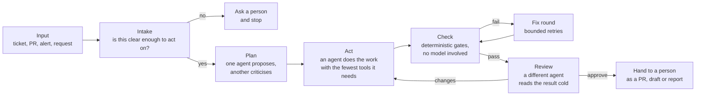

# An agentic AI workflow, in general

This folder is about the shape of the thing, not the QA pipeline in particular. The rest of the repository is one
instance of this shape, built for writing and checking Playwright tests. The same shape works for triage, code
review, data clean-up, release notes, support replies or anything else where a model has to do several steps and
somebody has to trust the result.

Three documents:

- this page: what the workflow is and the rules that make it hold together
- [testing-agentic-ai.md](testing-agentic-ai.md): how to test a system that has agents in it
- [demo-script.md](demo-script.md): a seven-minute walkthrough, with the places in this repository that show each
  point

## What "agentic" means here

A plain model call is a function: text in, text out, one shot. An agent is a model in a loop with tools. It reads,
decides what to do next, calls a tool (open a file, run a command, drive a browser), reads the result, and goes round
again until it is done or stopped. The model chooses the steps. That is what makes it useful and what makes it
dangerous: nobody wrote the exact sequence down in advance, so nobody can promise what it will do.

A workflow is the thing around the loop that makes the result trustworthy anyway. The model is a worker inside it,
not the thing in charge.

## The shape

Every box is a separate run with its own instructions, its own tool list and its own output schema. Nothing is one
long conversation.

### 1. Intake decides whether to proceed

The first stage does not do the work. It reads the request and answers one question in a fixed shape: can this be
acted on, and if not, what exactly is missing? A vague request gets a question back, not a guess. This is where most
of the quality is decided, because an agent given a vague brief will produce something confident and wrong.

In this repository: the ticket writer, the skeptic and the requirements analyst
([agents/prompts/](../agents/prompts/)). A request with open questions is labelled `qa-needs-info` and the pipeline
stops until somebody answers.

### 2. Planning is adversarial

One agent proposes a plan. A second agent, given the plan but not the first agent's reasoning, tries to find what it
missed. A third reconciles. A single agent asked to "plan carefully" will not catch its own blind spots; a critic with
a checklist and nothing else will.

In this repository: test architect, plan critic, plan reconciler, and the plan score that has to clear a bar in
`qa.config.json`.

### 3. The worker gets the fewest tools that do the job

Each agent has an allowlist. A reader gets Read, Glob and Grep inside the repository and nothing else. A writer gets
Write and Edit inside named folders and Bash for a short list of named commands. Nobody gets the network, the
tracker's credentials or the deploy key. Permission mode is "refuse what is not on the list", never "ask", because
nobody is there to answer.

In this repository: the Access and Tools columns in [docs/ARCHITECTURE.md](../docs/ARCHITECTURE.md), and the
runner in `agents/lib/`. Agent jobs on CI never hold a GitHub token; the publish job never holds the model token.

### 4. Checking is code, not a model

After the worker is done, scripts check the result. Did it only touch the folders it was allowed to? Does it compile,
lint, run? Does it do what it claims (every requirement traced to an artefact, every artefact traced back)? Does it
fail when it should fail? These gates have no judgement in them, which is the point: they cannot be talked round.

In this repository: [agents/gates.ts](../agents/gates.ts). Scope, types, lint, traceability, full suite, stability,
"fails for the right reason", sensitivity, sabotage.

### 5. Retries are bounded

A failed gate goes back to the worker with the failure attached, a fixed number of times. Then it stops and says so.
An unbounded loop burns money and eventually "fixes" the check instead of the work.

In this repository: the fix round and the rework round in `.github/workflows/qa-tests.yml`, one each.

### 6. Review is a different agent reading cold

A reviewer gets the finished work and the original requirement, not the worker's conversation. It answers per
requirement in a fixed shape: met, not met, with the evidence. It never edits. Its verdict decides whether the result
is handed over as ready or as a draft.

In this repository: the code reviewer, whose answer sets the pull request's draft state.

### 7. Every answer is structured and validated

Each stage answers in a JSON schema. An answer that does not parse fails the job. Nothing downstream reads free text.
This is what makes the whole thing testable (see [testing-agentic-ai.md](testing-agentic-ai.md)): a check can be
written against a field, and the same check runs against a live agent and a recorded answer.

In this repository: `agents/lib/schemas.ts`.

### 8. A person is at both ends and nowhere in the middle

Somebody writes the request. Somebody merges the result. In between, the workflow asks a question and stops when it
has to, but it never waits for a click. If the design needs a person in the middle, the stage boundaries are wrong.

### 9. Everything the agent did is written down where the requester can see it

Each stage posts what it decided to the ticket or the pull request: the assumptions, the plan and its score, the gate
report, the review per requirement, the cost. The ledger of model calls is kept per run. The run history shows, run
by run, how often the gates passed first time. Without this, "the AI did it" is the whole explanation, and that is
not an explanation.

In this repository: the comments on any `qa-pipeline` issue, the body of any `qa/req-*` pull request, the
`qa-history` branch.

## What it is not

- Not a chat. Nobody types to it while it runs.
- Not one agent with a long prompt and every tool. That is the easy version and it does not hold up.
- Not autonomous past the hand-off. It proposes; a person disposes.
- Not a replacement for the checks a team already has. It runs inside them.

## Reusing the shape

To apply it elsewhere, decide these in order: what is the input and who sends it; what does "clear enough to act
on" mean for that input; what does the worker produce and in which folders; what can a script check about that
product without a model; who reviews and in what shape they answer; and where the result lands for a person. The
agents' instructions are the last thing to write, not the first.
